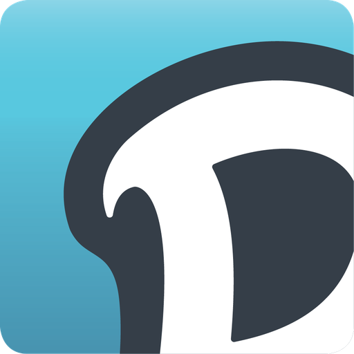

# Homebridge Dolphin Pool Cleaner

[](https://www.npmjs.com/package/@mp-consulting/homebridge-dolphin-pool-cleaner)
[](https://github.com/homebridge/homebridge/wiki/Verified-Plugins)
[](https://opensource.org/licenses/MIT)

Control your Maytronics Dolphin pool cleaning robot through Apple HomeKit using Homebridge.

<p align="center">
  
</p>

## Features

- **Start/Stop Cleaning** - Control your robot with a simple switch in HomeKit
- **Water Temperature** - View pool water temperature (when robot is in water)
- **Filter Status** - Get notified when the filter bag needs cleaning
- **Multiple Cleaning Modes** - Choose from 8 cleaning modes
- **Real-time Updates** - Instant status via AWS IoT MQTT
- **OTP/MFA Support** - Full two-factor authentication support
- **Siri Integration** - "Hey Siri, start pool cleaning"

## Supported Models

This plugin works with all Maytronics Dolphin robots that use the **MyDolphin Plus** app:

| Series | Models |
|--------|--------|
| M Series | M400, M600, M700 |
| S Series | S200, S300, S400 |
| E Series | E50, E60, E70 |
| Liberty | Liberty 300, Liberty 400 (cordless) |
| Sigma | Sigma |

> **Note**: Your robot must be IoT-enabled and connected to the MyDolphin Plus cloud service.

## Installation

### Via Homebridge UI (Recommended)

1. Open Homebridge UI
2. Go to **Plugins** tab
3. Search for `dolphin pool cleaner`
4. Click **Install** on `@mp-consulting/homebridge-dolphin-pool-cleaner`
5. Click **Settings** and use the setup wizard

### Via Command Line

```bash
npm install -g @mp-consulting/homebridge-dolphin-pool-cleaner
```

## Configuration

### Setup Wizard (Recommended)

The plugin includes a custom UI wizard that guides you through:

1. Enter your MyDolphin Plus email and password
2. Complete OTP verification (if enabled on your account)
3. Your robot is automatically discovered
4. Configure options and save

### Manual Configuration

Add to your Homebridge `config.json`:

```json
{
  "platforms": [
    {
      "platform": "DolphinPoolCleaner",
      "name": "Dolphin Pool Cleaner",
      "email": "your@email.com",
      "password": "yourpassword",
      "pollingInterval": 60,
      "devices": [
        {
          "serialNumber": "ABC123XYZ",
          "name": "Pool Robot",
          "cleaningMode": "regular",
          "enableTemperature": true,
          "enableFilterStatus": true
        }
      ]
    }
  ]
}
```

### Platform Options

| Option | Required | Default | Description |
|--------|----------|---------|-------------|
| `platform` | Yes | - | Must be `DolphinPoolCleaner` |
| `email` | Yes | - | MyDolphin Plus account email |
| `password` | Yes | - | MyDolphin Plus account password |
| `pollingInterval` | No | 60 | Status poll interval in seconds (30-600) |

### Device Options

| Option | Required | Default | Description |
|--------|----------|---------|-------------|
| `serialNumber` | Yes | - | Robot serial number (on power supply label) |
| `name` | No | Robot name | Display name in HomeKit |
| `cleaningMode` | No | `regular` | Default cleaning mode |
| `enableTemperature` | No | `true` | Show water temperature sensor |
| `enableFilterStatus` | No | `true` | Show filter maintenance indicator |

### Cleaning Modes

| Mode | Duration | Description |
|------|----------|-------------|
| `regular` | 150 min | All surfaces - floor, walls, and waterline |
| `short` | 60 min | Quick clean for light debris |
| `floor` | 150 min | Floor only |
| `wall` | 120 min | Walls only |
| `water` | 150 min | Waterline only |
| `ultra` | 150 min | Deep clean with extra passes |
| `cove` | 120 min | Focus on floor-wall junction |
| `spot` | 120 min | Concentrated area cleaning |

> **Note**: Available modes depend on your robot model. The setup wizard shows only modes supported by your robot.

## HomeKit Services

The plugin creates these HomeKit accessories for each robot:

| Service | Type | Description |
|---------|------|-------------|
| **Cleaning Switch** | Switch | Turn cleaning on/off |
| **Water Temperature** | Temperature Sensor | Pool water temp (when in water) |
| **Filter Status** | Filter Maintenance | Shows when filter needs cleaning |

## How It Works

```
┌─────────────┐     ┌──────────────┐     ┌─────────────┐     ┌─────────┐
│  HomeKit    │────▶│  Homebridge  │────▶│  AWS IoT    │────▶│  Robot  │
│  (iPhone)   │◀────│  Plugin      │◀────│  MQTT       │◀────│  (PWS)  │
└─────────────┘     └──────────────┘     └─────────────┘     └─────────┘
```

1. **Authentication**: AWS Cognito authenticates your MyDolphin Plus credentials
2. **Discovery**: REST API retrieves your robot information and AWS credentials
3. **Real-time Control**: MQTT connection to AWS IoT Core for instant commands
4. **State Sync**: Thing Shadows maintain robot state even when offline

## Troubleshooting

### "Invalid email or password"

- Verify credentials work in the official MyDolphin Plus app
- Check for special characters that may need escaping
- Ensure no extra spaces in email/password

### "OTP required"

Your account has two-factor authentication enabled. Use the setup wizard which handles OTP verification, or temporarily disable 2FA in the MyDolphin app.

### Robot not responding to commands

1. Check robot's power supply is plugged in and has WiFi connection
2. Verify robot appears online in MyDolphin Plus app
3. Check Homebridge logs for connection errors
4. Try restarting Homebridge

### Status shows "notConnected"

This is normal when the robot is out of the water or not docked on the power supply. The power supply reports connection status, not the robot itself.

### Filter always shows "needs cleaning"

The filter indicator is based on the `filterBagIndication.state` value (0-100%). Values above 80% trigger the maintenance alert. Reset the filter indicator in the MyDolphin Plus app after cleaning the filter.

### Temperature not showing

Water temperature is only available when the robot is actively in the water and its sensors are submerged.

## Debug Logging

Enable debug logging in Homebridge to see detailed plugin activity:

```bash
DEBUG=* homebridge -D
```

Or add to your Homebridge startup arguments:
```
-D
```

## Development

```bash
# Clone repository
git clone https://github.com/mp-consulting/homebridge-dolphin-pool-cleaner.git
cd homebridge-dolphin-pool-cleaner

# Install dependencies
npm install

# Build
npm run build

# Link for local testing
npm link

# Run with auto-reload
npm run watch
```

### Project Structure

```
src/
├── api/              # Maytronics API client and MQTT
│   └── auth/         # Authentication (Cognito, credentials)
├── devices/          # Robot device representation
├── accessories/      # HomeKit accessory implementation
├── parsers/          # Shadow state parsing
├── protocol/         # BLE command building
├── config/           # Constants and configuration
└── utils/            # Error handling utilities
```

Each module has a README with detailed documentation.

### Debug Scripts

```bash
# Dump robot shadow data (requires test/hbConfig/config.json)
npm run build && node test/scripts/dump-shadow.mjs
```

## Contributing

Contributions are welcome! Please:

1. Fork the repository
2. Create a feature branch
3. Submit a pull request

## License

MIT License - see [LICENSE](LICENSE) file.

## Disclaimer

This plugin is not affiliated with, endorsed by, or connected to Maytronics Ltd. "Dolphin" and "MyDolphin" are trademarks of Maytronics Ltd.

The MyDolphin Plus API is not officially documented. This plugin was developed through reverse engineering and may break if Maytronics changes their API.

## Support

- **Issues**: [GitHub Issues](https://github.com/mp-consulting/homebridge-dolphin-pool-cleaner/issues)
- **Discussions**: [GitHub Discussions](https://github.com/mp-consulting/homebridge-dolphin-pool-cleaner/discussions)

---

Made with :swimming_man: by [@mickael](https://github.com/mp-consulting)
